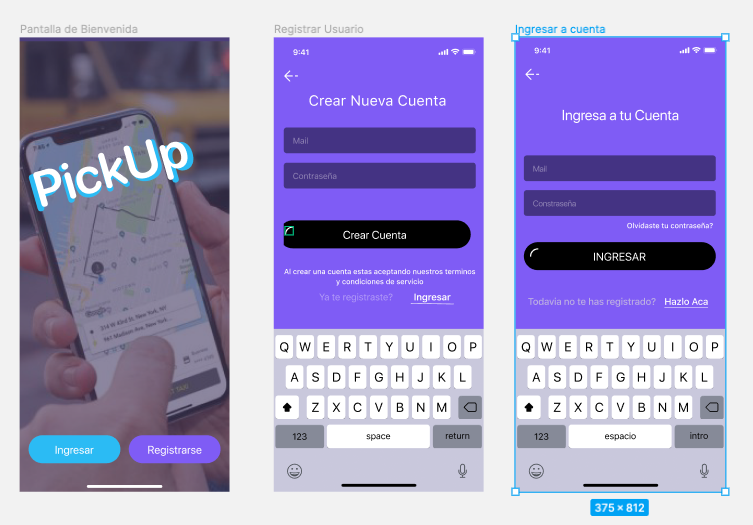

<p align="center">
        
</p>

# PickUp-Backend
Desarrollo de autenticacion de usuario y visibilidad de usuarios en linea para darle funcionalidad a nuestra aplicaccion PickUp

---

## Comienzo
Como no se que nivel de conocimiento de git y github tienen voy a escribir las instrucciones a comenzar como si fuesen nuevos en el tema.

Tenemos que tener cada uno una copia de este repositorio en nuetra cuenta de github o local en nuestras computadoras para comenzar a desarrollar el backend y poder colaborar paralelamente.


### Paso 1

   Clonar este repo a tu propio computador desde la consola, creando una nueva carpeta donde quieras contener todo el proyecto, navegar con la consola hacia ella y usar el comando
    
```
$ git clone -b develop https://github.com/Alvaro-Orellana/PickUp-BackEnd.git  
```

    
### Paso 2
        
   Cuando ya hayas finalizado de codear alguna funcionalidad hay que hacer los commits a git. Para poder hacer un guardar un archivo en git primero hay que hacer git add, y luego git commit. Usando -m para agregar un mensaje a tu commit (intentar que el mensaje sea lo mas descriptivo posible). 

   Para gregar individualmente
    `$ git add <nombre de archivo para agregar>` 
   Para agregar todos los archivos
    `$ git add .` 

   Despues de hacer el add hay que hacer el commit 
    `$ git commit -m 'Agrego funcionalidad X'`

       
    
### Paso 3
    
   Enviarlo a github haciendo un Push
    `$ git push`
    
   Aca es donde podrian ocurrir problemas, asi que hay que avisar cuando hagan el push la primera vez para verificar que si llego a github.
   
 Si funciona ya esta, pero si no funciona probablemente hay que agregar un remote y hacer lo siguiente
 
 `$ git remote add origin https://github.com/Alvaro-Orellana/PickUp-BackEnd.git`
 
 y despues
  `$ git push origin develop`

---

### Desarrollo del software 🔨🔨🔨 
Los objetivos principales de este producto minimo viable es que esten funcionando estas partes de la app:
   
A) Autenticacion de Usuario (Registro y loggeo)

B) Mostrar los conductores que esten en linea

C) Guardar y mostrar el historial de viajes

## A
   
   
---
 
## B y C
  
   
   	
 
